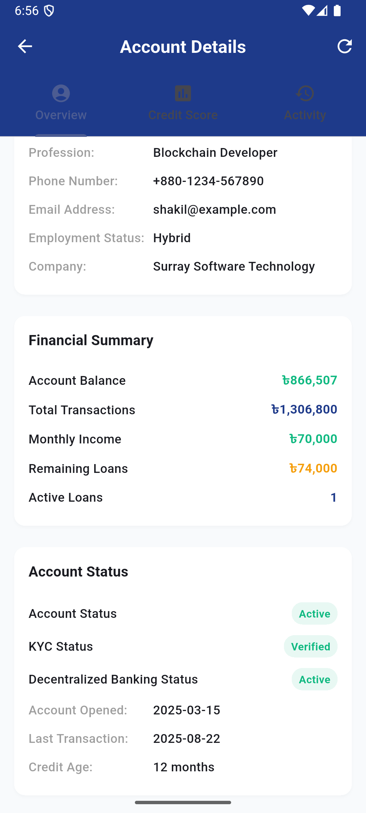

# 🏦 Midnight Bank Ltd. - Blockchain Loan Application

[](https://flutter.dev)
[](https://dart.dev)
[](https://ethereum.org)
[](https://web3dart.github.io/web3dart/)

A revolutionary **blockchain-powered personal loan and credit scoring application** built with Flutter. This app leverages decentralized technology to enhance consumers' financial accessibility through transparent and secure credit assessment.

## 🚀 How to Run the Project

### Prerequisites

Before running the application, ensure you have the following installed:

- **Flutter SDK** (>=3.9.0) - [Install Flutter](https://docs.flutter.dev/get-started/install)
- **Dart SDK** (>=3.9.0) - Comes with Flutter
- **Android Studio** or **VS Code** with Flutter extensions
- **Git** for version control

### 📱 Platform Requirements

- **Android**: API level 36 (Android 9.0) or higher
- **iOS**: iOS 14.0 or higher
- **Web**: Modern browsers with JavaScript enabled
- **Desktop**: Windows 10+, macOS 10.14+, or Linux

### 🔧 Installation Steps

1. **Clone the Repository**
   ```bash
   git clone https://github.com/ahmedmshakil/blockchain_loan_app.git
   cd blockchain_loan_app
   ```

2. **Install Dependencies**
   ```bash
   flutter pub get
   ```

3. **Configure Environment Variables**
   
   Copy the example environment file:
   ```bash
   cp .env.example .env
   ```
   
   Update the `.env` file with your configuration:
   - **Infura Project ID**: Get from [Infura.io](https://infura.io)
   - **Smart Contract Address**: Deploy your contract and add the address
   - **API Keys**: Add any required API keys

4. **Blockchain Configuration**
   
   Update the blockchain settings in `lib/config/blockchain_config.dart`:
   ```dart
   // Replace with your actual values
   static const String infuraProjectId = 'YOUR_INFURA_PROJECT_ID';
   static const String contractAddress = '0xYOUR_CONTRACT_ADDRESS';
   ```

5. **Generate App Icons** (Optional)
   ```bash
   flutter pub run flutter_launcher_icons:main
   ```

6. **Run the Application**
   
   For different platforms:
   ```bash
   # Android/iOS
   flutter run
   
   # Web
   flutter run -d chrome
   
   # Windows
   flutter run -d windows
   
   # macOS
   flutter run -d macos
   
   # Linux
   flutter run -d linux
   ```

### 🔍 Development Commands

```bash
# Run tests
flutter test

# Analyze code
flutter analyze

# Build for release (Android)
flutter build apk --release

# Build for release (iOS)
flutter build ios --release

# Build for web
flutter build web --release
```

## 📱 Application Screenshots

### 🏠 Main Interface
<div align="center">

| Main Page | Welcome Screen |
|-----------|----------------|
|  |  |

</div>

### 💰 Account Management
<div align="center">

| Account Overview | Account Details (Part 1) |
|------------------|---------------------------|
|  |  |

</div>

<div align="center">

| Account Details (Part 2) | Transaction History |
|---------------------------|---------------------|
|  |  |

</div>

### 🎯 Activity & Loan Status
<div align="center">

| Activity Dashboard | Loan Status |
|--------------------|-------------|
|  |  |

</div>

## ✨ Key Features

### 🔐 **Blockchain Integration**
- **Ethereum Sepolia Testnet** integration
- **Smart Contract** interactions for credit scoring
- **Web3** connectivity with secure wallet management
- **Decentralized** credit assessment system

### 🏦 **Banking Features**
- **Account Overview** with real-time balance tracking
- **Transaction History** with detailed records
- **Personal Loan** application and management
- **Credit Score** calculation and monitoring

### 🛡️ **Security & Privacy**
- **Secure Storage** for private keys and sensitive data
- **Biometric Authentication** support
- **Certificate Pinning** for network security
- **Cross-platform** security implementation

### 📊 **User Experience**
- **Intuitive Interface** with modern Material Design
- **Real-time Updates** and notifications
- **Multi-platform Support** (Android, iOS, Web, Desktop)
- **Responsive Design** for all screen sizes

## 🏗️ Architecture

The application follows **Clean Architecture** principles with clear separation of concerns:

```
lib/
├──  config/          # Configuration files
├──  models/          # Data models
├──  providers/       # State management
├──  screens/         # UI screens
├──  security/        # Security utilities
├──  services/        # Business logic
├──  utils/           # Helper utilities
└──  widgets/         # Reusable UI components
```

## 🛠️ Tech Stack

### **Frontend**
- **Flutter** - Cross-platform UI framework
- **Dart** - Programming language
- **Provider** - State management
- **Material Design 3** - UI components

### **Blockchain**
- **Ethereum** - Blockchain network
- **Solidity** - Smart contract language
- **Web3Dart** - Ethereum client library
- **Infura** - Blockchain node provider


## Author

👤 **Shakil Ahmed**

* LinkedIn: [@ahmedmshakil](https://www.linkedin.com/in/ahmedmshakil/)
* GitHub: [@ahmedmshakil](https://github.com/ahmedmshakil)

---
<div align="center">


[](https://github.com/ahmedmshakil/blockchain_loan_app)
[](https://github.com/ahmedmshakil/blockchain_loan_app)

</div>
